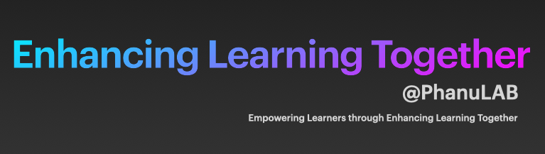

# Welcome to SSRUCS PhanuLAB

Interests focus around the Computer Science Education with domains of interest in Language Processing and Computing, Health Informatics, and Geoinformatics

<!--- Grupa za aplikacije i usluge na eksaskalarnoj istraživačkoj infrastrukturi / **G**roup for **A**pplications and **S**ervices on **E**xascale **R**esearch **I**nfrastructure --->

<!---## [Thai Language](th/index.md)--->

<!---still under development--->

<!---## [English Language](en/index.md)--->

This GitHub Pages features the current information about the resources pertinent to courses taught at SSRUCS by PhanuLAB as well as trends in computing and information technology through blog postings.

Below sections are organized as follow: current courses, course/lecture notes, professional and industrial guides on issues of contemporary importance, blog, and lastly the keywords list.

## Current courses
- [Discrete Mathematics](courses/mathdisc.md)
- [Data Mining Technology](courses/dmtech.md)
- [English for Academic and Specific Purposes](courses/easp.md)
     
     
## Course/Lecture Notess
- [DMTech-01-Lecture01](lecture-notes/dmtech-lect01-intro.md)
- [EASP-01-Lecture01](lecture-notes/easp-lect01-intro.md)
- [MathDisc-01-Lecture01](lecture-notes/mathdisc-lect01-intro.md)

## Guides

### FAIR Guide
- [0.Preface](fair-chapters/Preface.md)
- [1. Why FAIR training & training materials?](fair-chapters/chapter_01.md)
- [2. Structure materials for FAIRness"](fair-chapters/chapter_02.md)
- [3. Getting ready to create your materials or reuse](fair-chapters/chapter_03.md)
- [4. Using metadata to describe training materials](fair-chapters/chapter_04.md)
- [5. Get a persistent identifier for your training material](fair-chapters/chapter_05.md)
- [6. Make it accessible](fair-chapters/chapter_06.md)
- [7. Make it reusable](fair-chapters/chapter_07.md)
- [8. Licensing](fair-chapters/chapter_08.md)
- [9. Boosting discoverability](fair-chapters/chapter_09.md)
- [10. Recognition, acknowledgment, authorship](fair-chapters/chapter_10.md)
 
## Blog Posts
 
### Year 2023":
- [Sample Blog Post Title](posts/2023-01-21-sample-blog-post-title.md)
 
 
## Keywords list
 
Visit the link to gain access to [List of Keywords](keywords.md) compiled and autogenerated from the documentation published.

